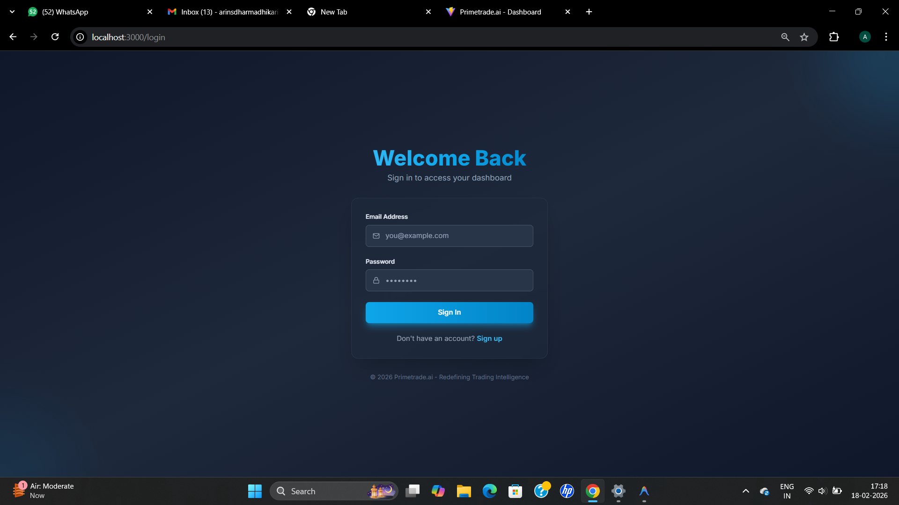
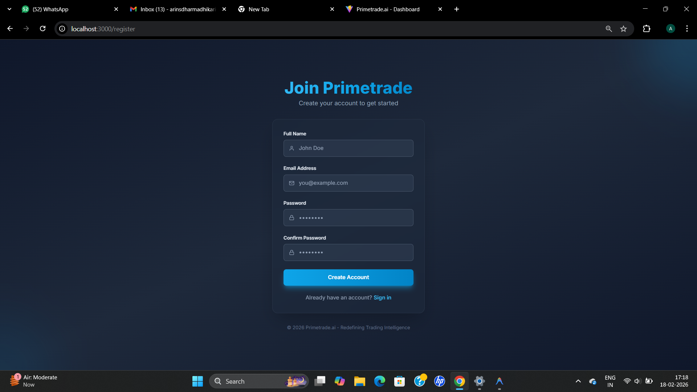
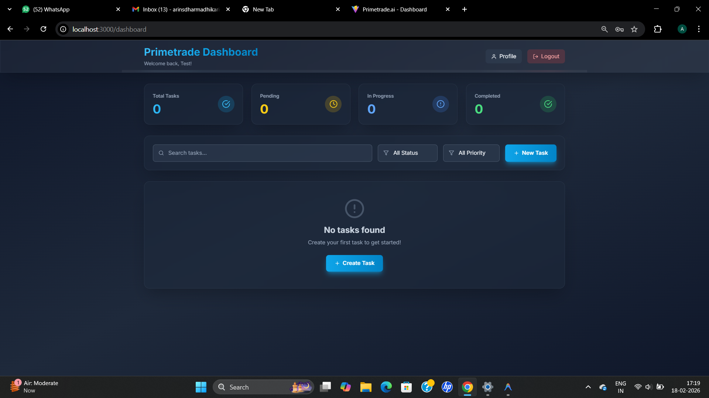
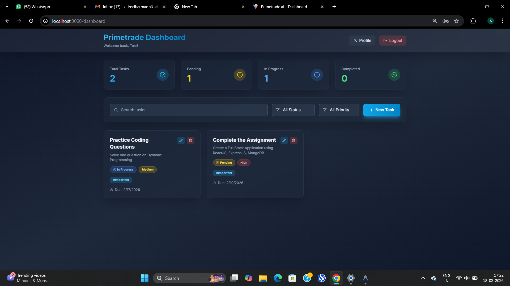
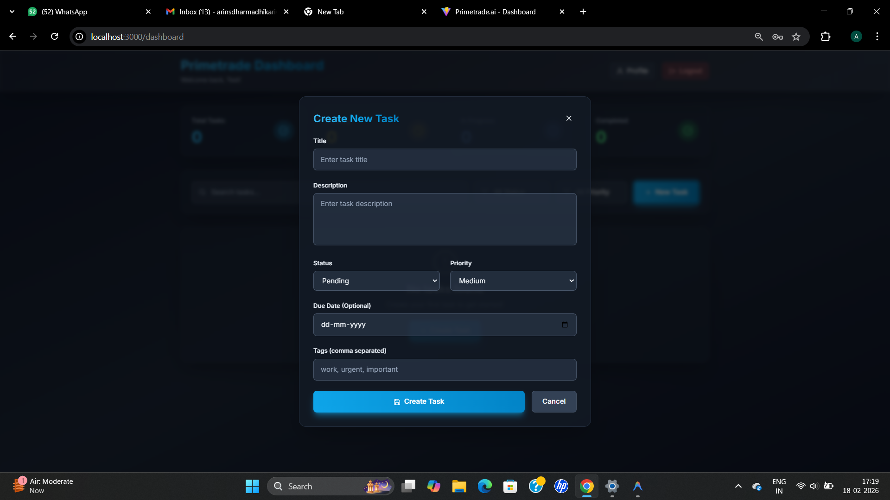
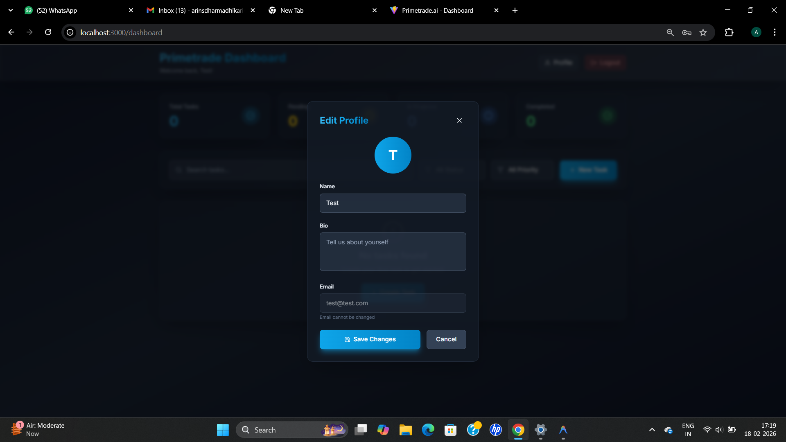

# Primetrade.ai - Full Stack Web Application

A modern, scalable full-stack web application with authentication and task management dashboard, built for the Primetrade.ai Frontend Developer Intern assignment.


## 🚀 Features

### Frontend (Primary Focus)
- ✅ Built with **React.js** and **Vite**
- ✅ Responsive design using **TailwindCSS**
- ✅ Forms with comprehensive validation (client + server side)
- ✅ Protected routes (login required for dashboard)
- ✅ Modern UI with glassmorphism and gradient effects
- ✅ Smooth animations and micro-interactions
- ✅ Search and filter functionality
- ✅ Real-time task statistics

### Backend (Supportive)
- ✅ Lightweight backend using **Node.js/Express**
- ✅ **JWT-based authentication**
- ✅ User signup/login with secure password hashing (**bcrypt**)
- ✅ Profile fetching and updating
- ✅ CRUD operations on tasks
- ✅ **MongoDB** database integration
- ✅ Input validation with express-validator
- ✅ Comprehensive error handling

### Security & Scalability
- ✅ Password hashing with bcrypt (10 salt rounds)
- ✅ JWT authentication middleware
- ✅ Error handling & validation
- ✅ Modular code structure for easy scaling
- ✅ Environment-based configuration
- ✅ CORS configuration
- ✅ Protected API routes

## 📸 Screenshots

### 🔑 Login Page


### 📝 Register Page


### 📊 Dashboard


### ✅ Dashboard After Adding Task


### ➕ Create New Task


### 👤 Edit Profile


---

## 📋 Tech Stack

### Frontend
- **Framework**: React 18
- **Build Tool**: Vite
- **Styling**: TailwindCSS
- **Routing**: React Router DOM v6
- **HTTP Client**: Axios
- **Icons**: React Icons (Feather Icons)

### Backend
- **Runtime**: Node.js
- **Framework**: Express.js
- **Database**: MongoDB with Mongoose
- **Authentication**: JWT (jsonwebtoken)
- **Password Hashing**: bcryptjs
- **Validation**: express-validator
- **Environment**: dotenv

## 🛠️ Installation & Setup

### Prerequisites
- Node.js (v16 or higher)
- MongoDB (local or Atlas)
- npm or yarn

### Backend Setup

1. Navigate to the backend directory:
```bash
cd backend
```

2. Install dependencies:
```bash
npm install
```

3. Create a `.env` file:
```env
PORT=5000
MONGODB_URI=mongodb://localhost:27017/primetrade
JWT_SECRET=your_super_secret_jwt_key_change_this_in_production
JWT_EXPIRE=7d
NODE_ENV=development
```

4. Make sure MongoDB is running, then start the server:
```bash
# Development mode with auto-reload
npm run dev

# Production mode
npm start
```

The backend will be available at `http://localhost:5000`

### Frontend Setup

1. Navigate to the frontend directory:
```bash
cd frontend
```

2. Install dependencies:
```bash
npm install
```

3. Create a `.env` file:
```env
VITE_API_URL=http://localhost:5000/api
```

4. Start the development server:
```bash
npm run dev
```

The frontend will be available at `http://localhost:5173`

## 📁 Project Structure

```
primetrade-app/
├── backend/
│   ├── config/
│   │   └── db.js                 # Database connection
│   ├── controllers/
│   │   ├── authController.js     # Authentication logic
│   │   └── taskController.js     # Task CRUD logic
│   ├── middleware/
│   │   ├── auth.js              # JWT authentication
│   │   ├── errorHandler.js      # Error handling
│   │   └── validation.js        # Input validation
│   ├── models/
│   │   ├── User.js              # User model
│   │   └── Task.js              # Task model
│   ├── routes/
│   │   ├── auth.js              # Auth routes
│   │   └── tasks.js             # Task routes
│   ├── .env                     # Environment variables
│   ├── .gitignore
│   ├── package.json
│   ├── server.js                # Main server file
│   └── README.md
│
└── frontend/
    ├── src/
    │   ├── components/
    │   │   └── ProtectedRoute.jsx
    │   ├── context/
    │   │   └── AuthContext.jsx
    │   ├── pages/
    │   │   ├── Login.jsx
    │   │   ├── Register.jsx
    │   │   └── Dashboard.jsx
    │   ├── utils/
    │   │   └── api.js
    │   ├── App.jsx
    │   ├── main.jsx
    │   └── index.css
    ├── .env
    ├── .gitignore
    ├── index.html
    ├── package.json
    ├── tailwind.config.js
    ├── postcss.config.js
    ├── vite.config.js
    └── README.md
```

## 🔐 API Endpoints

### Authentication
- `POST /api/auth/register` - Register new user
- `POST /api/auth/login` - Login user
- `GET /api/auth/me` - Get current user (protected)
- `PUT /api/auth/profile` - Update profile (protected)

### Tasks
- `GET /api/tasks` - Get all tasks with filters (protected)
- `GET /api/tasks/:id` - Get single task (protected)
- `POST /api/tasks` - Create new task (protected)
- `PUT /api/tasks/:id` - Update task (protected)
- `DELETE /api/tasks/:id` - Delete task (protected)
- `GET /api/tasks/stats` - Get task statistics (protected)

### Health Check
- `GET /api/health` - Server health check

## 🎨 UI/UX Highlights

- **Dark Theme**: Modern dark theme with vibrant accent colors
- **Glassmorphism**: Frosted glass effects for cards and modals
- **Gradients**: Beautiful gradient text and buttons
- **Animations**: Smooth fade-in, slide-up, and hover animations
- **Responsive**: Mobile-first design that works on all devices
- **Accessibility**: Semantic HTML and proper ARIA labels
- **Loading States**: Visual feedback for all async operations
- **Error Handling**: User-friendly error messages

## 🔒 Security Features

1. **Password Security**
   - Bcrypt hashing with 10 salt rounds
   - Password strength validation
   - Minimum requirements enforced

2. **Authentication**
   - JWT tokens with expiration
   - Token stored in localStorage
   - Automatic token validation
   - Protected routes on frontend and backend

3. **Input Validation**
   - Client-side validation with visual feedback
   - Server-side validation with express-validator
   - SQL injection prevention
   - XSS protection

4. **Error Handling**
   - Centralized error handling
   - No sensitive data exposure
   - Proper HTTP status codes

## 📈 Scalability Considerations

### Current Implementation
1. **Modular Architecture**: Separated concerns (MVC pattern)
2. **Stateless Authentication**: JWT for horizontal scaling
3. **Database Indexing**: Optimized queries
4. **Environment Configuration**: Easy deployment
5. **Code Organization**: Clear separation of concerns

### Production Scaling Strategy

#### Backend
- **Load Balancing**: Use Nginx or AWS ELB
- **Database**: 
  - MongoDB Atlas with replica sets
  - Database connection pooling
  - Implement caching with Redis
- **API Gateway**: Rate limiting and request throttling
- **Microservices**: Split into auth, tasks, and user services
- **Message Queue**: RabbitMQ or AWS SQS for async tasks
- **Monitoring**: PM2, New Relic, or DataDog

#### Frontend
- **CDN**: CloudFront or Cloudflare for static assets
- **Code Splitting**: React lazy loading
- **State Management**: Redux or Zustand for complex state
- **PWA**: Service workers for offline support
- **Performance**: 
  - Image optimization
  - Bundle size optimization
  - Lazy loading components

#### DevOps
- **Containerization**: Docker and Docker Compose
- **Orchestration**: Kubernetes for container management
- **CI/CD**: GitHub Actions or Jenkins
- **Monitoring**: ELK stack or Prometheus + Grafana
- **Testing**: Jest, React Testing Library, Supertest

## 🚀 Deployment

### Backend Deployment Options
- **Heroku**: Easy deployment with MongoDB Atlas
- **AWS EC2**: Full control with PM2 process manager
- **DigitalOcean**: App Platform or Droplet
- **Railway**: Modern deployment platform
- **Render**: Free tier available

### Frontend Deployment Options
- **Vercel**: Optimized for React/Vite
- **Netlify**: Easy deployment with CI/CD
- **AWS S3 + CloudFront**: Scalable static hosting
- **GitHub Pages**: Free hosting for static sites

## 📝 Testing

### Backend Testing
```bash
cd backend
npm test
```

### Frontend Testing
```bash
cd frontend
npm test
```

## 🤝 Contributing

This project was created for the Primetrade.ai Frontend Developer Intern assignment.

## 📄 License

ISC

## 👨‍💻 Author

Created for Primetrade.ai Frontend Developer Intern Assignment

## 📧 Contact

For questions or feedback, please contact:
- saami@primetrade.ai
- nagasai@primetrade.ai
- chetan@primetrade.ai
- cc: sonika@primetrade.ai

---

**Note**: This project demonstrates modern web development practices, security implementations, and scalable architecture suitable for production environments.
